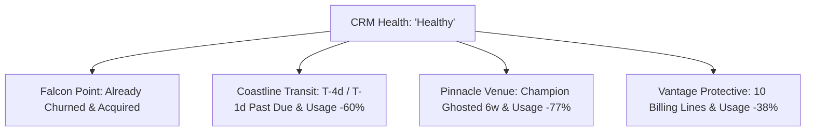

# Customer Success Book of Business — Data Reconnaissance

## 1. Executive Summary

This reconnaissance document provides a comprehensive analysis of the FlytBase Customer Success Book of Business gathered via the 9 MCP tools over Streamable HTTP. 

The portfolio consists of **14 customer accounts** across 5 distinct lifecycle stages, representing **$216,427 in nominal ARR** ($211,429 active + $4,998 churned), with hundreds of pages of unstructured data across 89 total documents, transcripts, emails, tickets, renewal trackers, and usage histories.

---

## 2. Complete Account Inventory

| Account ID | Name | Lifecycle Category | Nominal ARR | Docks Description | CRM Health | CRM Sentiment | Tagged Champion | CS Owner | SE Owner | Usage Data |
|---|---|---|---|---|---|---|---|---|---|---|
| `ashford-construction` | Ashford Construction Group | `pre-sale` | $0 | 0 live (POC quoted); 13 mapping docks | Healthy | Neutral | None | — | Farhan Qureshi | `[]` (0 mo) |
| `ridgemont-polymers` | Ridgemont Polymers | `pre-sale` | $0 | 0 (prospect; 12 yards potential) | — | Neutral | None | — | Deep Malhotra | `[]` (0 mo) |
| `swiftline-logistics` | Swiftline Logistics | `pre-sale` | $0 | 0 (prospect; last-mile yards) | — | Neutral | None | — | Rhea Kapoor | `[]` (0 mo) |
| `camborne-constabulary` | Camborne Constabulary | `newly-sold-onboarding` | $3,999 | 0 deployed (contract signed) | Healthy | Positive (sales) | None | Jordan Ashby | Farhan Qureshi | `[]` (0 mo) |
| `amber-ridge-processing` | Amber Ridge Processing | `newly-sold-onboarding` | $3,999 | 1 | Healthy | Neutral | Mack Stockhausen | Unnati Patil | Rudrev Dave | 4 mo (1–6h) |
| `meridian-energy` | Meridian Energy Corp | `established` | $9,600 | 1 (15+ tender in prep) | Healthy | Positive | Ross Doak | Devon Achebe | Rhea Kapoor | 8 mo (14–35h) |
| `vantage-protective` | Vantage Protective Services | `established` | $29,400 | 10 deployed, 2 pending | Healthy | Positive | None | Nadia Ferreira | Callum Reyes | 8 mo (47→29h) |
| `walcross-materials` | Walcross Materials | `established` | $53,246 | Large multi-site fleet | Healthy | — | None | Nivedita Huple | Pranjal Suyal | 8 mo (60→112h) |
| `northline-grid` | Northline Grid Authority | `renewal-focused` | $61,400 | 6 (4 Gen2, 2 Gen3) | Healthy | Positive | None | Priya Nandakumar | Marcus Oyelaran | 8 mo (52→64h) |
| `coastline-transit` | Coastline Transit Authority | `renewal-focused` | $32,790 | Multiple across corridor | Healthy | Neutral | Isaac (Operator) | Neel Okafor | Rudrev Dave | 8 mo (38→15h) |
| `whitecliff-vineyard` | Whitecliff Vineyard Estates | `renewal-focused` | $2,799 | 1 | Healthy | — (never logged) | None | Nivedita Huple | Pranjal Suyal | 8 mo (5–7h) |
| `pinnacle-venue-group` | Pinnacle Venue Group | `renewal-focused` | $19,995 | 3 | Healthy | Neutral | Danny Ruiz (unresponsive) | Marcus Oyelaran | Callum Reyes | 8 mo (22→5h) |
| `ravel-systems` | Ravel Systems | `churned` | $999 | 1 (license lapsed) | At Risk → Churned | — (never logged) | None | Deepa Anand | Ravi Krishnan | 4 mo (3→0h) |
| `falcon-point-security` | Falcon Point Security | `churned` | $3,999 | 8 of 20 deployed | Healthy | Positive | None | Deep Malhotra / Nivedita Huple | Pranjal Suyal | 6 mo (30→0h) |

---

## 3. Available Data Sources & Document Types

### A. Core Data Sources
1. **Account Metadata API (`list_accounts`, `get_account`)**: Surface-level CRM snapshot (IDs, category, ARR, assigned owners, static health/sentiment).
2. **Document Manifest API (`list_account_documents`)**: Per-account file directory of available source evidence.
3. **Raw Document API (`get_account_document`)**: Full-text Markdown content of all transcripts, emails, tickets, notes, and trackers.
4. **Usage API (`get_account_usage`)**: Monthly time-series of `flightHours` and `missions` (active flying accounts).
5. **Search API (`search_documents`)**: Cross-portfolio keyword and entity search.

### B. Document Types Discovered Across the Portfolio
- `profile`: CRM export table listing high-level account attributes.
- `transcript`: Verbatim multi-party call dialogue (scoping calls, ops walkthroughs, finance check-ins, executive reviews).
- `email`: Direct correspondence chains between FlytBase personnel, customer stakeholders, procurement, and billing.
- `notes`: Internal CS/SE Slack-style notes containing candid team observations, background context, and off-the-record developments.
- `deal`: Pre-sale deal timelines, pricing proposals (v1, v2, v3), milestone terms, and negotiation history.
- `tickets`: Zendesk-style support tickets with issue titles, severity, root cause analysis (RCA), and resolution states.
- `renewal`: Renewal & subscription tables detailing per-dock license lines, expiration dates, term lengths, and status flags.

---

## 4. Important Information Tiers & Field Breakdown

### Tier 1: Explicit Metadata (What CRM Tells Us)
- Basic identity (`id`, `name`, `vertical`, `region`, `tier`).
- Assigned personnel (`csOwner`, `seOwner`).
- CRM static status (`health`, `sentiment`, `category`).
- Headline financial metrics (`arr`, `docks` count string).

### Tier 2: Document-Only Information (Hidden Truths & Nuances)
- **True Stakeholders & Roles**: Distinguishing economic buyers (e.g. Edward Throsby at Amber Ridge, Richmond Wohlhueter at Ridgemont) from day-to-day operators (Isaac at Coastline, Charlie Dawson at Amber Ridge, Bradley Osei at Ashford).
- **Champion Dynamics**: Identifying actual champions vs departed champions (Mitch leaving Amber Ridge, Danny Ruiz ghosting at Pinnacle) or unlisted champions (Ross Doak at Meridian).
- **Operational Blockers**: Regulatory hurdles (UK CAA / DPO compliance and Grade II listed building at Camborne), network/power constraints (Ridgemont edge power issues), and false alarms/calibration.
- **Commercial Negotiations & Restructuring**: Milestone splits ($14,499 50/50 split at Ashford), billing consolidation requests (10 separate invoices at Vantage), government voucher delays (Coastline).
- **M&A / Organizational Changes**: Corporate acquisition of Falcon Point by Ridgeline Protective Group.

### Tier 3: Usage History (Telemetry Evidence)
- **Trajectory Velocity**: Usage growth trends (`walcross-materials` +86%, `meridian-energy` +150%) vs collapse trends (`pinnacle-venue-group` -77%, `coastline-transit` -60%, `vantage-protective` -38%).
- **Seasonality vs Churn**: Winter dips (`northline-grid` Feb freeze) vs terminal drop-offs (`falcon-point-security` 0h in May, `ravel-systems` 0h in Dec).

---

## 5. Contradictions & Discrepancies Found

The CRM records contain severe contradictions where metadata claims an account is "Healthy" or "Positive", but underlying documents and usage data demonstrate extreme risk or outright churn:



### Top Critical Contradictions:
1. **Falcon Point Security (`falcon-point-security`)**:
   - *CRM Metadata*: `Health: Healthy`, `Sentiment: Positive`, `ARR: $3,999`.
   - *Ground Reality*: Account is **Churned**! Acquisition by Ridgeline Protective Group led to vendor consolidation. Usage dropped to 0 hours in May 2026. Non-renewal confirmed in writing.
2. **Coastline Transit Authority (`coastline-transit`)**:
   - *CRM Metadata*: `Health: Healthy`, `Sentiment: Neutral`, `Champion: Isaac (Operator)`.
   - *Ground Reality*: Imminent renewal crisis — **Plan A expires in T-4 days**, **Plan B is T-1 day (past due)**. Usage collapsed from 38h to 15h (-60%). Isaac has zero procurement authority; government purchase voucher is stalled.
3. **Pinnacle Venue Group (`pinnacle-venue-group`)**:
   - *CRM Metadata*: `Health: Healthy`, `Sentiment: Neutral`.
   - *Ground Reality*: **High churn risk**. Flight hours plummeted from 22h to 5h (-77%). Tagged champion Danny Ruiz has been completely unresponsive for 6 weeks. New security director Carla Ibsen has unresolved event security concerns.
4. **Vantage Protective Services (`vantage-protective`)**:
   - *CRM Metadata*: `Health: Healthy`, `Sentiment: Positive`.
   - *Ground Reality*: Usage declined steadily from 47h to 29h (-38%). Severe client frustration regarding 10 separate staggered invoices. Primary telemetry node failover bug caused telemetry reporting gaps.
5. **Camborne Constabulary (`camborne-constabulary`)**:
   - *CRM Metadata*: `Health: Healthy`, `Sentiment: Positive (from sales cycle)`.
   - *Ground Reality*: Onboarding stalled 3+ weeks post-signature. No discovery call prior to closing. Blocked by DPO evidentiary compliance review and Grade II listed building council planning restrictions.
6. **Ashford Construction Group (`ashford-construction`)**:
   - *CRM Metadata*: `ARR: $0`, `Champion: None`.
   - *Ground Reality*: $14,499 pilot quote approved by finance (50/50 milestone split). Real underlying potential is 18+ docks ($100k+ ARR), blocked only by a pending customer reference call.

---

## 6. Ten Concrete Examples of AI-Derivable Signals

1. **Usage Drop Risk Score**: Detecting accounts with >30% flight-hour declines over 90 days (`pinnacle-venue-group`, `coastline-transit`, `vantage-protective`).
2. **Champion Ghosting / Contact Velocity**: Flagging when a tagged champion has not appeared in emails or transcripts for >30 days (`Danny Ruiz` at Pinnacle).
3. **Stakeholder Persona Extraction**: Automatically identifying the Economic Buyer, Technical Lead, Security Lead, and Procurement Gatekeeper from transcript attendee lists and dialogue.
4. **Renewal Urgency Radar**: Computing exact days-to-expiration across individual subscription lines and correlating with open billing/procurement tickets (`coastline-transit` T-4d renewal).
5. **Expansion Opportunity Index**: Scoring accounts with steady usage acceleration, positive transcripts, and multi-site tenders (`meridian-energy` tender for 15+ docks, `walcross-materials` scaling across quarries).
6. **Expansion Trap Detector**: Flagging accounts requesting more hardware despite decreasing utilization of existing deployed docks (`vantage-protective` requesting 2 new docks while 10 existing docks usage fell 38%).
7. **Onboarding Stagnation Alert**: Detecting newly-sold accounts with 0 flight hours after 2+ weeks post-signature (`camborne-constabulary` 3 weeks post-sign with 0 docks live).
8. **M&A / Acquisition Risk Signal**: Parsing emails/transcripts for corporate restructuring, mergers, or parent-company vendor consolidation (`falcon-point-security` acquired by Ridgeline).
9. **Sentiment Disconnect Metric**: Computing divergence between CRM health labels and transcript NLP sentiment scores.
10. **Win-Back Viability Classifier**: Distinguishing administrative/neglect churn (`ravel-systems` — low touch, delayed client site, high win-back potential) from systemic consolidation churn (`falcon-point-security` — requires parent-company negotiation).

---

## 7. Deterministic vs. AI-Derived Signals Taxonomy

```
+-------------------------------------------------------------------------------+
|                             PORTFOLIO INTELLIGENCE                            |
+---------------------------------------+---------------------------------------+
|          DETERMINISTIC ENGINE         |           LLM REASONING LAYER         |
|   (Rule-based, Mathematical, Exact)   |   (Synthesizing, Contextual, NLP)    |
+---------------------------------------+---------------------------------------+
| - Usage trend percentage (MoM, QoQ)   | - Real vs Nominal Health assessment   |
| - Days until renewal per line item    | - Champion engagement sentiment       |
| - Active vs Churned ARR totals        | - Stakeholder hierarchy & authority   |
| - Document count & type breakdown     | - Root cause of churn / risk analysis |
| - Open ticket severity counts         | - Expansion opportunity vs trap score |
| - Time elapsed since last meeting     | - Next best recommended action & why  |
| - Missing document type detection     | - Contradiction detection (CRM vs doc)|
+---------------------------------------+---------------------------------------+
```

---

## 8. Dynamic Late-Data Update Analysis (~4:30 PM Scenario)

### Expected Hackathon Mutation Events:
- **New Source Documents**: Additional call transcripts, urgent email chains, new support tickets.
- **Removed Documents**: Specific existing files being deprecated or deleted from an account manifest.
- **Usage Telemetry Increments**: A new month of flight hours and mission counts added to live series.
- **Metadata Changes**: Reassigned owners, updated ARR figures, modified CRM status flags.

### Real-Time Detection & Sync Architecture:
To ensure the system picks up updates autonomously without manual intervention:
1. **Manifest Polling Engine**: Poll `list_accounts` and `list_account_documents` at recurring intervals (e.g. every 60–120 seconds).
2. **Content Hash & Diffing**: Maintain a SHA-256 hash or version map of all documents per account. Compare file lists and content hashes:
   - Added file $\rightarrow$ Trigger incremental LLM extraction.
   - Removed file $\rightarrow$ Invalidate cached inferences for that document.
   - Modified file $\rightarrow$ Re-evaluate document summary.
3. **Usage Vector Diffing**: Detect when array length `len(usage)` increases or numbers change $\rightarrow$ Recompute deterministic usage slope.
4. **Reactive Re-Aggregation**: When any account changes, trigger a cascade re-calculation of portfolio health, renewal risk radar, and prioritized GTM action queue.

---

## 9. Recommendations for the Intelligence Layer

1. **Bimodal Processing Pipeline**:
   - Run deterministic metrics (usage growth, renewal deadlines, ARR aggregations) via pure code for zero-latency, 100% precision.
   - Run LLM reasoning over structured document excerpts to generate qualitative synthesis (health diagnosis, risks, strategic recommendations).
2. **Account Synthesis Schema**:
   Every account should produce a unified intelligence payload:
   - `trueHealth`: Reconciled health status (Healthy / At Risk / Critical / Churned).
   - `healthRationale`: 2-sentence explanation citing concrete evidence.
   - `keyContacts`: Array of `{ name, role, authority, sentiment, status }`.
   - `renewalRisk`: Urgent renewal status and revenue exposure.
   - `strategicNextStep`: Prioritized action item for CS/SE team.
3. **Portfolio Action Queue**:
   Rank all 14 accounts by urgency score so the GTM team immediately sees who needs attention first (e.g. `coastline-transit` $\rightarrow$ `pinnacle-venue-group` $\rightarrow$ `camborne-constabulary`).
