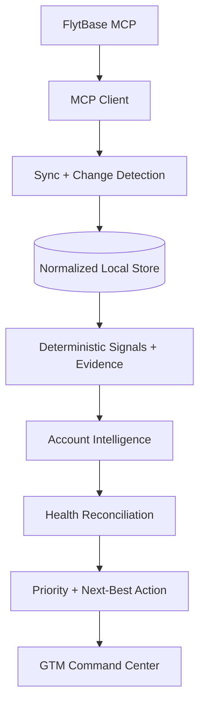
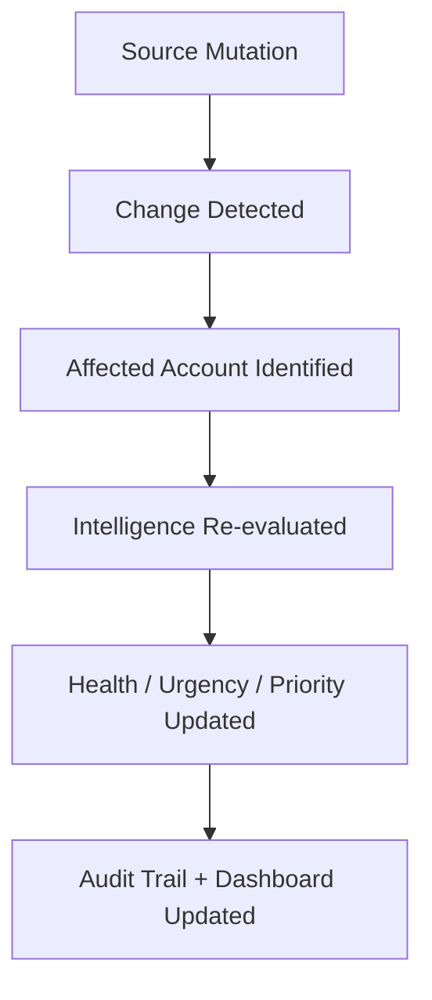

# FlytBase GTM Intelligence
### Turn scattered customer signals into prioritized GTM decisions

---

## 1. The Problem

Customer intelligence is fragmented across CRM records, emails, call transcripts, support tickets, internal notes, renewal information, and usage telemetry.

This creates three core problems:
- **Stale CRM truth**: An account can be marked *Healthy* while real customer behavior indicates serious risk.
- **Expansion traps**: A request for more hardware may look like growth while existing fleet adoption is declining.
- **Manual analysis**: Every new customer signal requires humans to re-read documents and reassess account state.

---

## 2. Our Solution

**FlytBase GTM Intelligence** is an evidence-backed, continuously updating GTM decision system.

$$\text{Sync} \longrightarrow \text{Understand} \longrightarrow \text{Reconcile} \longrightarrow \text{Prioritize} \longrightarrow \text{Act} \longrightarrow \text{Update}$$

It connects to the FlytBase MCP Book of Business, normalizes account data, combines deterministic signals with qualitative intelligence, grounds decisions in source evidence, and automatically re-evaluates affected accounts when data changes.

---

## 3. Key Design Decisions

- **MCP as source of truth**: Real-time access to accounts, documents, and telemetry.
- **Local normalized cache**: In-memory SQLite store for sub-millisecond querying and incremental processing.
- **Deterministic computation**: Strict formulas for ARR, usage trajectories, renewal timing, activity recency, priority scoring, and change detection.
- **Qualitative intelligence**: Contextual reasoning for stakeholder interpretation, hidden risk factors, expansion intent, and next-best actions.
- **Evidence grounding**: Every derived conclusion links to a source document, exact verbatim excerpt, and confidence score.
- **Health vs. urgency separation**: High-ARR accounts are not conflated with critical operational triage.
- **Expansion-trap detection**: Evaluates hardware requests alongside usage adoption and billing friction.
- **Incremental re-evaluation**: Only affected accounts are reprocessed after source mutations.

---

## 4. Architecture

### Continuous Intelligence Loop

---

## 5. What We Built

- **GTM Command Center**: Portfolio ARR, revenue at risk, expansion potential, prioritized action queue, health mismatches, opportunities, traps, and 14-account portfolio table.
- **Account 360**: Reconciled health, risks, blockers, stakeholders, usage trends, next-best actions, and source evidence.
- **Health Mismatch Detection**: Identifies cases where CRM status conflicts with actual customer behavior.
- **Expansion Intelligence**: Distinguishes genuine enterprise expansion from expansion traps.
- **Evidence Layer**: Traces important conclusions to source documents and exact excerpts.
- **Sync & Audit**: Tracks account, document, and usage mutations, and records before-and-after intelligence re-evaluations.

---

## 6. Real Examples

### Coastline Transit Authority
- **CRM**: `Healthy` $\longrightarrow$ **Ground Truth**: `Critical`
- ~60% usage deterioration + past-due renewal + procurement voucher blockage.
- **Action**: Escalate payment/procurement clearance.

### Pinnacle Venue Group
- **CRM**: `Healthy` $\longrightarrow$ **Ground Truth**: `Critical`
- ~77% usage decline + champion unresponsive for 6+ weeks.
- **Action**: Executive re-engagement.

### Vantage Protective Services
- Requested additional docks, but utilization fell ~38% and billing friction remained.
- **Conclusion**: Expansion Trap.

### Meridian Energy Corp
- Usage increased ~150% + enterprise tender for 15+ substations + documented $100K+ upside.
- **Conclusion**: High-confidence expansion opportunity.

---

## 7. Scale & AI Judgment

The system is designed for **incremental intelligence** rather than full-portfolio recomputation after every change.

- **Deterministic where correctness matters**: ARR, usage, renewal timing, hashes, priority calculations, and change detection.
- **AI / qualitative reasoning where context matters**: Stakeholders, hidden risks, expansion intent, contradictions, and next-best actions.

This keeps the system explainable, efficient, and resilient as the portfolio grows.

---

## 8. Technology

`Next.js` · `TypeScript` · `Prisma` · `SQLite` · `FlytBase MCP` · `Recharts` · `Tailwind` · `Deterministic Analytics` · `Evidence-backed Intelligence` · `Automated Synchronization` · `LLM Gateway with Deterministic Fallback`

---

## 9. Impact

$$\text{14 Accounts} \quad\cdot\quad \text{87 Documents} \quad\cdot\quad \text{70 Usage Snapshots}$$

The system shifts GTM work from:

> *"Search through customer information and figure out what is happening."*

to:

> **"Here is what is happening, why it matters, what the evidence says, and what you should do next."**
