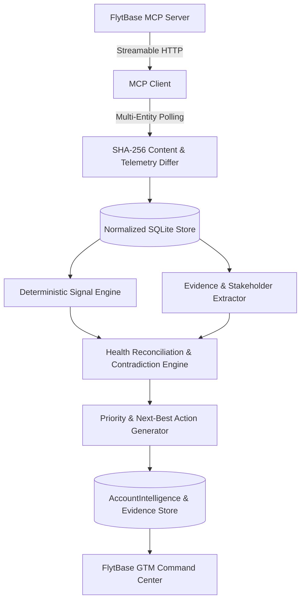
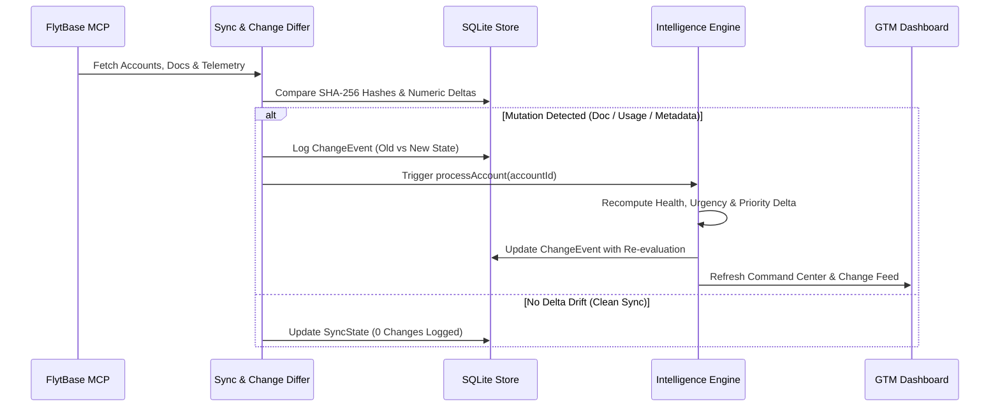

# FlytBase GTM Intelligence
> **Evidence-backed GTM decision system that turns fragmented customer signals into prioritized risks, opportunities, and next-best actions with continuous account re-evaluation.**

---

## 1. Overview & Problem Statement

In enterprise drone-in-a-box orchestration, customer data is scattered across CRM records, call transcripts, support tickets, internal notes, renewal tables, and monthly flight telemetry.

Customer Success (CS) and Solutions Engineering (SE) teams face three critical friction points:
1. **Stale CRM Truth**: Accounts marked *Healthy* in CRM often mask operational flight collapse, ghosted champions, or unexecuted contracts.
2. **Expansion Traps**: Hardware expansion requests can look like growth when the customer's existing fleet is actually underutilized with unresolved billing friction.
3. **Manual Analysis Paralysis**: When new transcripts or telemetry arrive, teams must manually re-read documents rather than executing prioritized, evidence-backed actions.

**FlytBase GTM Intelligence** solves this by maintaining a normalized, continuously synchronized cache of the 14-account Book of Business from the FlytBase MCP Server, computing deterministic signals, reconciling true account health, detecting contradictions and expansion traps, and generating prioritized next-best actions grounded in verbatim source citations.

---

## 2. Key Capabilities

- **Portfolio Command Center (`/`)**: Real-time Book of Business overview showing Total ARR ($216.4k), Revenue at Risk ($82.2k), Expansion Upside ($114.5k+), and Critical Triage emergencies.
- **Prioritized GTM Action Queue**: Deterministically ranked triage queue displaying primary triggers, P0/P1 concrete actions, expected business outcomes, and direct evidence links.
- **Cross-Account Portfolio Signals**: Real-time aggregation of macro patterns across the portfolio (Telemetry drops, Renewal pressure, Contradictions, Expansion tenders, Expansion traps, Blockers, Ghosted champions, and Win-back candidates).
- **CRM Health Mismatch Radar**: Signature exception-monitoring panel detecting accounts where recorded CRM status conflicts with actual telemetry or contract blockers.
- **Expansion Radar**: Separates high-confidence enterprise RFP tenders from risky **Expansion Traps**.
- **Explainable Decision Chain**: Transparent 4-stage reasoning (`Raw Signal` $\rightarrow$ `Interpretation` $\rightarrow$ `Business Impact` $\rightarrow$ `Recommended Action`) on Account 360 profiles.
- **Account 360° Console (`/accounts/[id]`)**: Executive brief, health diagnosis, stakeholder/champion mapping, Recharts telemetry charts, and raw document viewer.
- **Traceable Evidence Drawer**: Slide-over audit drawer linking every derived claim to the source filename, verbatim quote, and confidence score.
- **Sync & Audit Trail (`/changes`)**: Real-time mutation engine monitoring SHA-256 document checksums, telemetry deltas, and before/after intelligence re-evaluations.

---

## 3. Architecture & Data Flow



### Incremental Re-evaluation Loop



---

## 4. Technology Stack

- **Framework**: Next.js 15 (App Router, Server Components & Server Actions)
- **Language**: TypeScript 5.7 (Strict end-to-end type safety)
- **Database & ORM**: SQLite with Prisma ORM
- **Protocol**: Model Context Protocol (MCP) Streamable HTTP Client
- **Data Visualization**: Recharts (Monthly flight hours & mission telemetry)
- **Styling**: TailwindCSS (Dark enterprise command-center palette)
- **Intelligence Layer**: Hybrid deterministic signal engine + evidence extraction + optional LLM Gateway with deterministic fallback

---

## 5. Local Setup & Installation

### Prerequisites
- Node.js 18+ (tested on Node.js 20 & 24)
- npm or yarn

### 1. Clone the Repository
```bash
git clone https://github.com/devansh0005/flytbase-gtm-intelligence.git
cd flytbase-gtm-intelligence
```

### 2. Install Dependencies
```bash
npm install
```

### 3. Configure Environment Variables
Copy the `.env.example` template:
```bash
cp .env.example .env
```

Edit `.env` to supply your FlytBase MCP Bearer Token:
```env
DATABASE_URL="file:./dev.db"
FLYTBASE_MCP_ENDPOINT="https://flytbase-gtm-hackathon.lovable.app/api/mcp"
FLYTBASE_MCP_TOKEN="your_mcp_bearer_token_here"

# Optional: Gemini API Key for LLM reasoning layer (gracefully falls back if omitted)
GEMINI_API_KEY=""
```

> **Security Notice**: Never commit real API keys, bearer tokens, or `.env` files to source control. `.gitignore` is configured to exclude all `.env` files and SQLite database files.

### 4. Initialize Database
```bash
npx prisma db push
npx prisma generate
```

### 5. Start Development Server
```bash
npm run dev
```
Open [http://localhost:3000](http://localhost:3000) in your browser.

---

## 6. Commands & Scripts

| Command | Description |
|---|---|
| `npm run dev` | Starts Next.js development server on `http://localhost:3000` |
| `npm run build` | Compiles production bundle with full TypeScript validation |
| `npm start` | Runs the production build server |
| `npm run db:push` | Synchronizes Prisma schema with local SQLite database |
| `npm run db:generate` | Generates Prisma client types |

---

## 7. Hackathon Context (PS-5 Customer Success)

This repository is built for the **FlytBase GTM Hackathon — Problem Statement 5: Customer Success & Solutions Engineering Intelligence**.

- **Dataset**: 14 Accounts, 87 Documents, 70 Monthly Usage Telemetry records.
- **Source of Truth**: Live FlytBase MCP Server.
- **Grounded AI**: Zero numerical hallucinations; all qualitative reasoning references verbatim excerpts from underlying transcripts, emails, and renewal trackers.
- **Late-Data Ready**: Built-in SHA-256 diffing and incremental re-evaluation engine designed for real-time upstream data mutations.
